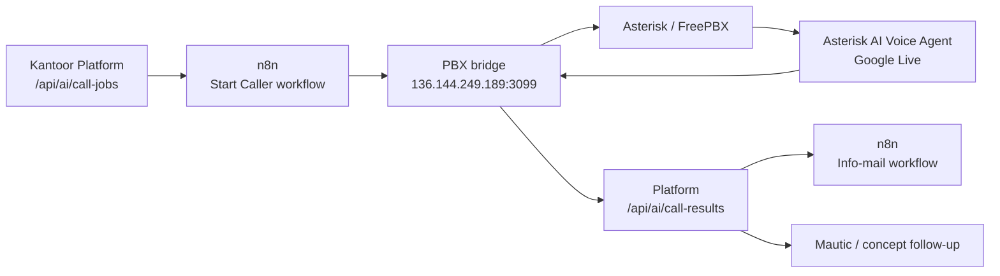

# De Vree Makelaardij — Kantoor Platform

Centraal kantoor platform dat alle systemen van De Vree Makelaardij met elkaar verbindt.

## Modules

- **Agenda** — Realworks agendakoppeling: dag- en weekweergave per medewerker, auto-koppeling van woningprojecten via `agobjcode`, enrichment van kijkersgegevens via Mautic, PDF-contextendpoint voor bezichtigingsvoorbereiding
- **Dashboard** — Tijdsgebonden begroeting, overzicht van openstaande taken en recente activiteit
- **Telefonie** — Live call popups, call history, Mautic CRM koppeling, notities per gesprek, contact detail panel met AI data profiel
- **Digitale medewerker** — Beheerbare agentprofielen, taakprofielen, outbound AI-belkaarten voor bezichtigingsopvolging, Mautic, n8n info-mail en concept follow-up
- **Taken** — Kanban + tabeloverzicht, per makelaar en centraal voor binnendienst, met tijdregistratie per taak
- **Projecten** — Woningdossiers (Verkoop / Aankoop / Taxatie) gekoppeld aan taken, gesprekken, Mautic contacten en Notion. Bevat dossier tab met commerciële gegevens, kadastrale info en kosten. Projecten kunnen worden samengevoegd
- **Contacten** — Mautic CRM overzicht met zoekfunctie, contactdetails bewerken, AI data profiel en email activiteit. Nieuw contact aanmaken direct vanuit de pagina
- **Pipeline** — Kanban-board op basis van `verkoopgesprek_status` uit Mautic, met interesse-scores en AI profielen
- **Kansen** — Actielijst op basis van Realworks-objectmutaties, zoekprofielen en Mautic websitegedrag. Signaleert o.a. actieve interesse en nieuwe woningmatches
- **Kijkers / Leads** — Leadregistratie met routehistorie, projectkoppelingen, adviseurkoppeling, prioriteit, tags en export
- **Samenwerkingen** — Hypotheekadviseurs en VvE-gesprekken met statistieken per adviseur
- **WhatsApp** — Inbox/conversaties via Evolution/WAHA, plus conceptberichten vanuit de digitale medewerker en afspraakherinneringen
- **Facebook Triggers** — Beheer van keyword- en DM-antwoorden voor de Facebook/n8n workflow
- **Buurtdata** — Opzoeken van wijkdata op basis van postcode + huisnummer via n8n. Genereert een printbaar rapport met: BAG-gegevens, leefbaarheidsscore, bevolkingssamenstelling, huishoudens, woningmarkt, inkomen, bereikbaarheid, klimaat, geluidsbelasting, luchtkwaliteit en optionele Fridu Radar-omgevingssignalen. Beschikbaar als interne tool (authenticated) én als publieke lead generator via `/buurtdata-rapport` (WordPress shortcode `[buurtdata_rapport]`)
- **Realworks Browser Extensie** — Chrome-extensie voor Realworks → n8n/platform sync, backup/discovery captures en terugschrijftaken naar Realworks
- **Tijdregistratie** — Timer per taak (start/pauze/stop) + handmatig tijd toevoegen, logboek van sessies, beschikbaar via API
- **Mautic** — CRM contacten opzoeken, aanmaken en bijwerken (inclusief AI data profiel en email activiteit)
- **Notion** — Bidirectionele sync via n8n webhooks

## Tech Stack

Next.js · TypeScript · Tailwind CSS · Prisma · MySQL · NextAuth.js · Docker

---

## Digitale medewerker en PBX

Het platform kan digitale medewerker-profielen, taakprofielen en AI-belkaarten beheren voor opvolging na bezichtigingen. Een medewerker moet elke call handmatig vrijgeven door exact `BEL` te bevestigen. Daarna start het platform via n8n en de PBX bridge een outbound call op de aparte PBX-server.

### Architectuur



### Belkaart-flow

1. Het platform maakt een `AiCallJob` aan vanuit agenda/context of als handmatige testkaart.
2. De kaart staat op `ready` totdat een medewerker hem expliciet goedkeurt met `BEL`.
3. `POST /api/ai/call-jobs/[id]/start` stuurt de kaart naar de n8n start-workflow.
4. n8n roept de PBX bridge aan op `POST /start`.
5. De bridge weigert calls zonder approval-blok en maakt daarna een eenmalige outbound campaign/lead in Asterisk AI Voice Agent.
6. Na afloop post de bridge transcript, samenvatting, klantvragen, opvolging en links terug naar `/api/ai/call-results`.
7. Het platform zet de job op `completed`, queued de info-mail naar `info@` via n8n en maakt follow-up concepten klaar.

### Productiecomponenten

| Component | Locatie |
|-----------|---------|
| Platform | `ghcr.io/mdevree/devree-platform` op `136.144.253.219` |
| PBX server | `136.144.249.189` |
| PBX bridge | `/opt/devree-ai-bridge/app.py`, service `devree-ai-bridge.service` |
| Bridge health | `http://127.0.0.1:3099/health` op de PBX |
| AI engine | Docker container `ai_engine` op de PBX |
| AI context | `devree_bezichtiging_followup` |
| Admin UI | `http://pbx.devreemakelaardij.nl:3003/`, alleen via trusted firewall IP's |
| Info-mail | n8n workflow `AI Belassistent - Info Email` |

### Gespreksregels

- Altijd de volledige naam **De Vree Makelaardij** gebruiken.
- Kort openen, reden noemen en vragen of het uitkomt.
- Concreet vragen naar algemene indruk, interesse, twijfels en klantvragen.
- Geen technische woninginformatie, documenten of links beloven tenzij die expliciet in de belkaart/linkcontext staan.
- Technische of objectspecifieke vragen letterlijk noteren en doorzetten naar een collega.
- Maximaal vier punten samenvatten, vragen of dit klopt, correcties verwerken en daarna zelf ophangen.

### Operationele aandachtspunten

- Live tests moeten direct na opnemen met een korte begroeting starten; stilte kan door AMD terecht als voicemail/initial silence worden gezien.
- De PBX-firewall is streng. Voor de admin UI op poort `3003` moet het actuele publieke IP in de trusted-zone staan.
- De huidige PBX heeft beperkte RAM-capaciteit. Voor stabiele realtime audio is minimaal 2 GB RAM wenselijk, liever 4 GB.
- Details, herstelcommando's en testbevindingen staan in `pbx/ai-belassistent-notities.md` en `pbx/devree-ai-bridge/README.md`.

---

## API Overzicht

Alle endpoints accepteren twee authenticatiemethoden:

1. **Sessie-cookie** — standaard voor gebruik vanuit de browser (NextAuth)
2. **`x-webhook-secret` header** — voor server-to-server aanroepen (n8n, externe systemen)

```
x-webhook-secret: <N8N_WEBHOOK_SECRET>
```

Webhooks (POST naar `/webhook`) gebruiken uitsluitend de `x-webhook-secret` header.

---

### Authenticatie

| Methode | Endpoint | Omschrijving |
|---------|----------|--------------|
| `GET / POST` | `/api/auth/[...nextauth]` | NextAuth.js sessie afhandeling (login, logout, session check) |

---

### Digitale medewerker `/api/ai`

Alle server-to-server calls gebruiken `x-webhook-secret`.

| Methode | Endpoint | Omschrijving |
|---------|----------|--------------|
| `GET/PATCH` | `/api/ai/agent-profile` | Beheer het standaardprofiel van de digitale medewerker |
| `GET/PATCH` | `/api/ai/tasks` | Beheer taakprofielen zoals `bezichtiging_nabellen` |
| `GET` | `/api/ai/caller-status` | Controleert of caller, start-webhook en info-mail zijn geconfigureerd |
| `GET` | `/api/ai/call-jobs` | Laat de laatste belkaarten zien, optioneel gefilterd op status |
| `POST` | `/api/ai/call-jobs` | Maakt een belkaart aan vanuit `agendaAfspraakId` of handmatige payload |
| `PATCH` | `/api/ai/call-jobs/[id]` | Werkt een belkaart bij |
| `POST` | `/api/ai/call-jobs/[id]/start` | Start alleen na menselijke goedkeuring met `approvalText: "BEL"` |
| `POST` | `/api/ai/call-results` | Ontvangt resultaten van de PBX bridge en queued opvolging |
| `GET` | `/api/ai/follow-up-drafts` | Conceptopvolging, standaard alleen actief: `draft`, `approved`, `failed` |
| `POST` | `/api/ai/follow-up-drafts` | Maak een concept voor WhatsApp of e-mail; verzendt nog niets |
| `PATCH` | `/api/ai/follow-up-drafts/[id]` | Werk status/body/metadata van een concept bij |
| `POST` | `/api/ai/follow-up-drafts/[id]/send` | Verzend een goedgekeurd concept via de ingestelde provider |
| `GET` | `/api/ai/link-catalog` | Geeft toegestane links voor AI/follow-up: aanbod, vragen, verkoop, aankoop en taxatie |
| `POST` | `/api/ai/link-catalog/sync` | Synchroniseert linkcatalogus vanuit WordPress en vaste dienstlinks |

#### Handmatige testkaart

```json
{
  "source": "manual_test",
  "contactName": "Sanne de Jong",
  "contactPhone": "0612636255",
  "language": "nl",
  "propertyTitle": "Kikkerven 255",
  "propertyAddress": "Kikkerven 255",
  "propertyUrl": "https://www.devreemakelaardij.nl/aanbod/",
  "context": {
    "test": true,
    "callGoals": [
      "vraag of het uitkomt",
      "vraag naar algemene indruk",
      "vraag of de woning nog interessant is",
      "noteer technische vragen letterlijk"
    ]
  },
  "scriptPreview": "Opening: Goedemiddag Sanne, met de digitale assistent van De Vree Makelaardij. Komt het uit?"
}
```

#### Start-call approval

```json
{
  "startedBy": "medewerker",
  "reviewedBy": "medewerker",
  "humanApproved": true,
  "approvalText": "BEL"
}
```

#### Follow-up concepten en linkactiviteit

`GET /api/ai/follow-up-drafts` accepteert `status=active|draft|approved|sent|rejected|alle`. De digitale medewerker toont standaard alleen actieve concepten, zodat oude verzonden of afgewezen concepten de interface niet vervuilen.

Drafts worden verrijkt met `activity` uit `MauticEvent` op basis van `mauticContactId`, meegestuurde URL's en `rcode`. Daardoor kan de UI laten zien of een woninglink of andere opvolg-link al is bezocht. Voor WhatsApp-links naar de eigen website is `page.hit` het belangrijkst; voor Mautic-mails is `email.click` relevant.

---

### Taken `/api/taken`

| Methode | Endpoint | Omschrijving |
|---------|----------|--------------|
| `GET` | `/api/taken` | Haal taken op met filters en paginering |
| `POST` | `/api/taken` | Maak een nieuwe taak aan |
| `PATCH` | `/api/taken` | Werk een bestaande taak bij |
| `DELETE` | `/api/taken` | Verwijder een taak |
| `POST` | `/api/taken/webhook` | Verwerk taken van n8n / Notion sync |

#### `GET /api/taken` — Query parameters

| Parameter | Type | Omschrijving |
|-----------|------|--------------|
| `status` | `string` | Filter op status. Meerdere mogelijk: `open,bezig,afgerond` |
| `priority` | `string` | Filter op prioriteit. Meerdere mogelijk: `laag,normaal,hoog,urgent` |
| `category` | `string` | Filter op categorie: `binnendienst`, `verkoop`, `aankoop`, `taxatie`, `administratie` |
| `assigneeId` | `string` | Filter op toegewezen gebruiker (ID) |
| `projectId` | `string` | Filter op project (ID), of `none` voor taken zonder project |
| `search` | `string` | Zoekterm — doorzoekt titel en beschrijving |
| `dueDateFrom` | `ISO 8601` | Taken met deadline op of na deze datum |
| `dueDateTo` | `ISO 8601` | Taken met deadline op of voor deze datum |
| `sortBy` | `string` | Sorteerveld: `status` \| `priority` \| `dueDate` \| `createdAt` \| `completedAt` \| `title` (standaard: `status`) |
| `sortOrder` | `string` | `asc` of `desc` (standaard: `asc`) |
| `page` | `number` | Paginanummer (standaard: `1`) |
| `limit` | `number` | Aantal resultaten per pagina (standaard: `50`, max: `200`) |

**Response:**
```json
{
  "tasks": [...],
  "pagination": { "page": 1, "limit": 50, "total": 120, "pages": 3 }
}
```

Elke taak bevat ook `totalTimeSpent` (seconden) en `timerStartedAt` (null als timer niet loopt).

#### `POST /api/taken` — Body

| Veld | Vereist | Omschrijving |
|------|---------|--------------|
| `title` | ✅ | Taaknaam |
| `assigneeId` | ✅ | ID van de toegewezen gebruiker |
| `description` | | Toelichting |
| `priority` | | `laag` \| `normaal` \| `hoog` \| `urgent` (standaard: `normaal`) |
| `category` | | Categorie |
| `dueDate` | | Deadline (ISO 8601) |
| `projectId` | | Koppelen aan een project |
| `notionPageId` | | Notion pagina ID voor sync |

#### `PATCH /api/taken` — Body

Stuur `id` + de velden die je wilt bijwerken. Bij `status: "afgerond"` wordt `completedAt` automatisch ingesteld.

#### `DELETE /api/taken` — Body

```json
{ "id": "taak-id" }
```

#### `POST /api/taken/webhook` — Notion/n8n sync

Header: `x-webhook-secret`

| Veld | Omschrijving |
|------|--------------|
| `action` | `create` \| `update` \| `delete` |
| `title` | Taaknaam |
| `assigneeEmail` | Wordt omgezet naar gebruiker-ID |
| `projectNotionPageId` | Wordt omgezet naar project-ID |
| `notionPageId` | Gebruikt als unieke sleutel voor upsert |
| `status`, `priority`, `category`, `dueDate`, `description` | Optionele taakvelden |

---

### Tijdregistratie `/api/taken/[id]/timer`

Per taak kan tijd worden bijgehouden via een timer of handmatige invoer. Elke sessie wordt opgeslagen als `TimeEntry`.

| Methode | Endpoint | Omschrijving |
|---------|----------|--------------|
| `GET` | `/api/taken/[id]/timer` | Haal de huidige timerstatus op |
| `POST` | `/api/taken/[id]/timer` | Start, pauzeer of stop de timer |
| `PATCH` | `/api/taken/[id]/timer` | Voeg handmatig tijd toe |
| `DELETE` | `/api/taken/[id]/timer` | Reset alle tijdregistratie voor deze taak |

#### `GET /api/taken/[id]/timer` — Response

```json
{
  "isRunning": true,
  "timerStartedAt": "2025-01-15T09:00:00.000Z",
  "totalTimeSpent": 3600,
  "currentSessionSeconds": 420,
  "totalSeconds": 4020,
  "entries": [
    {
      "id": "...",
      "startedAt": "2025-01-15T08:00:00.000Z",
      "stoppedAt": "2025-01-15T09:00:00.000Z",
      "duration": 3600
    }
  ]
}
```

#### `POST /api/taken/[id]/timer` — Body

```json
{ "action": "start" }
```

| Actie | Omschrijving |
|-------|--------------|
| `start` | Start een nieuwe sessie (fout als timer al loopt) |
| `pause` | Sluit de lopende sessie af en sla de duur op |
| `stop` | Zelfde als pause, bedoeld als definitief stoppen |

#### `PATCH /api/taken/[id]/timer` — Handmatig tijd toevoegen

Gebruik dit als je vergeten bent de timer te starten. Er wordt een `TimeEntry` aangemaakt met de berekende start/stop tijden.

```json
{ "hours": 1, "minutes": 30 }
```

**Response:**
```json
{
  "action": "added",
  "addedSeconds": 5400,
  "totalTimeSpent": 9000
}
```

#### `DELETE /api/taken/[id]/timer`

Reset `totalTimeSpent` naar `0`, verwijdert alle `TimeEntry` records en stopt een eventueel lopende timer.

---

### Projecten `/api/projecten`

| Methode | Endpoint | Omschrijving |
|---------|----------|--------------|
| `GET` | `/api/projecten` | Haal projecten op met filters en paginering |
| `POST` | `/api/projecten` | Maak een nieuw project aan |
| `PATCH` | `/api/projecten` | Werk een bestaand project bij |
| `DELETE` | `/api/projecten` | Verwijder een project (ontkoppelt taken en calls eerst) |
| `GET` | `/api/projecten/[id]` | Haal één project op inclusief alle taken, calls en contacten |
| `POST` | `/api/projecten/[id]/contacts` | Koppel een Mautic contact aan een project |
| `DELETE` | `/api/projecten/[id]/contacts` | Ontkoppel een Mautic contact van een project |
| `GET` | `/api/projecten/merge` | Preview van het samenvoegen van twee projecten |
| `POST` | `/api/projecten/merge` | Voeg twee projecten samen (taken, calls en contacten verplaatst naar doelproject) |
| `POST` | `/api/projecten/webhook` | Verwerk projecten van n8n / Notion sync (upsert op `notionPageId`) |

#### `GET /api/projecten` — Query parameters

| Parameter | Type | Omschrijving |
|-----------|------|--------------|
| `type` | `string` | Filter op projecttype: `VERKOOP` \| `AANKOOP` \| `TAXATIE` |
| `statusGroup` | `string` | Filter op statusgroep: `lead` \| `active` \| `terminal` |
| `search` | `string` | Zoekterm — doorzoekt naam, adres, contactnaam en e-mail |
| `page` | `number` | Paginanummer (standaard: `1`) |
| `limit` | `number` | Aantal resultaten per pagina (standaard: `50`) |

**Response:**
```json
{
  "projects": [...],
  "pagination": { "page": 1, "limit": 50, "total": 34, "pages": 1 }
}
```

Elk project bevat:
- `_count.tasks` en `_count.calls` — aantal gekoppelde taken en gesprekken
- `calls` — lijst met calls inclusief `_count.notes` per gesprek
- `contacts` — gekoppelde Mautic contacten (via `ProjectContact`)
- `totalTimeSpent` — som van alle `totalTimeSpent` van gekoppelde taken (in seconden)

#### `POST /api/projecten` — Body

| Veld | Vereist | Omschrijving |
|------|---------|--------------|
| `name` | ✅ | Projectnaam |
| `type` | | `VERKOOP` \| `AANKOOP` \| `TAXATIE` (standaard: `VERKOOP`) |
| `projectStatus` | | Projectstatus conform `STATUS_FLOW` (standaard: `LEAD`) |
| `description` | | Omschrijving |
| `verkoopstart` | | `DIRECT` \| `UITGESTELD` \| `SLAPEND` (alleen bij VERKOOP) |
| `startdatum` | | Beoogde startdatum (bij UITGESTELD) |
| `startReden` | | Reden voor uitstel / slapend |
| `woningAdres` | | Adres van het object |
| `woningPostcode` | | Postcode van het object |
| `woningPlaats` | | Woonplaats van het object |
| `woningOppervlakte` | | Oppervlakte (vrij tekstveld, bijv. `"120 m²"`) |
| `kadGemeente` / `kadSectie` / `kadNummer` | | Kadastrale gegevens |
| `vraagprijs` | | Vraagprijs (VERKOOP) / Aankoopbudget (AANKOOP) / Taxatiewaarde (TAXATIE) in € |
| `courtagePercentage` | | Courtage percentage (bijv. `"1.2"`) |
| `verkoopmethode` | | Verkoopmethode (alleen VERKOOP) |
| `bijzondereAfspraken` | | Vrije tekst voor bijzondere afspraken |
| `kostenPubliciteit` / `kostenEnergielabel` / `kostenJuridisch` / `kostenBouwkundig` / `kostenIntrekking` / `kostenBedenktijd` | | Kostenposten in € (integers, alleen VERKOOP) |
| `contactName` / `contactPhone` / `contactEmail` | | Legacy contactvelden |
| `notionPageId` | | Notion pagina ID voor sync |
| `realworksId` | | Koppelt het project aan de woning op de website via Realworks ID |

#### `POST /api/projecten/[id]/contacts` — Body

```json
{ "mauticContactId": 123, "role": "opdrachtgever" }
```

Upsert — als het contact al gekoppeld is, wordt alleen de `role` bijgewerkt.

#### `DELETE /api/projecten/[id]/contacts` — Body

```json
{ "mauticContactId": 123 }
```

#### `POST /api/projecten/merge` — Body

```json
{ "sourceId": "project-id-1", "targetId": "project-id-2" }
```

Alle taken, calls en contacten van `sourceId` worden verplaatst naar `targetId`. `sourceId` wordt daarna verwijderd.

#### `POST /api/projecten/webhook` — Notion/n8n sync

Header: `x-webhook-secret`

Upsert op basis van `notionPageId`. Vereiste velden: `notionPageId`. Overige velden optioneel (zie POST body hierboven).

---

### Calls `/api/calls`

| Methode | Endpoint | Omschrijving |
|---------|----------|--------------|
| `GET` | `/api/calls` | Haal afgeronde calls op met filters en paginering |
| `PATCH` | `/api/calls/[id]/project` | Koppel of ontkoppel een call aan een project |
| `GET` | `/api/calls/[id]/notes` | Haal notities op van een gesprek |
| `POST` | `/api/calls/[id]/notes` | Voeg een notitie toe aan een gesprek (triggert optioneel webhook) |
| `DELETE` | `/api/calls/[id]/notes` | Verwijder een notitie (body: `{ "noteId": "..." }`) |
| `GET` | `/api/calls/stream` | Server-Sent Events (SSE) stream voor live call meldingen |
| `POST` | `/api/calls/webhook` | Verwerk call events van n8n / Voys |

#### `GET /api/calls` — Query parameters

| Parameter | Type | Omschrijving |
|-----------|------|--------------|
| `direction` | `string` | `inbound` of `outbound` |
| `reason` | `string` | Reden van beëindiging (bijv. `completed`, `no-answer`, `busy`, `cancelled`) |
| `projectId` | `string` | Filter op gekoppeld project |
| `search` | `string` | Zoekterm — doorzoekt nummer, naam, contactnaam en bestemmingsnummer |
| `from` | `ISO 8601` | Calls vanaf deze datum |
| `to` | `ISO 8601` | Calls tot en met deze datum |
| `page` | `number` | Paginanummer (standaard: `1`) |
| `limit` | `number` | Aantal resultaten per pagina (standaard: `50`) |

Geeft alleen calls met `status: "ended"` terug.

#### `PATCH /api/calls/[id]/project` — Body

```json
{ "projectId": "project-id" }
```

Stuur `projectId: null` om de koppeling te verwijderen.

#### `POST /api/calls/[id]/notes` — Body

```json
{ "note": "Tekst van de notitie" }
```

Na opslaan wordt optioneel een webhook aangeroepen naar `CALL_NOTE_WEBHOOK_URL` met de volgende payload:

| Veld | Omschrijving |
|------|--------------|
| `noteId` | ID van de nieuwe notitie |
| `callId` | Unieke call-ID van het telefoniesysteem |
| `timestamp` | Tijdstip van het gesprek |
| `direction` | `inbound` of `outbound` |
| `callerNumber` | Beller telefoonnummer |
| `callerName` | Naam van de beller (indien beschikbaar) |
| `destinationNumber` | Bestemmingsnummer |
| `mauticContactId` | Gekoppeld Mautic contact ID |
| `contactName` | Naam van het Mautic contact |
| `projectId` | Gekoppeld project ID |
| `projectName` | Naam van het gekoppelde project |
| `note` | De notitietekst |
| `createdBy` | Naam van de medewerker die de notitie schreef |
| `createdAt` | Tijdstip van aanmaken |

#### `GET /api/calls/stream` — SSE

Geen authenticatie vereist. Verbind met dit endpoint voor real-time call events. Stuurt een heartbeat elke 30 seconden.

Event types: `connected`, `call-ringing`, `call-ended`

#### `POST /api/calls/webhook` — Voys/n8n call events

Header: `x-webhook-secret` (optioneel, afhankelijk van `N8N_WEBHOOK_SECRET` env var)

Verwerkt alle call statussen: `ringing`, `in-progress`, `ended`. Zoekt automatisch het contactnummer op in Mautic. Pusht events naar alle verbonden SSE clients.

---

### Gebruikers `/api/users`

| Methode | Endpoint | Omschrijving |
|---------|----------|--------------|
| `GET` | `/api/users` | Haal alle actieve gebruikers op |

**Response:**
```json
{
  "users": [
    { "id": "...", "name": "...", "email": "...", "role": "..." }
  ]
}
```

---

### Mautic `/api/mautic`

| Methode | Endpoint | Omschrijving |
|---------|----------|--------------|
| `GET` | `/api/mautic/contact?phone=0612345678` | Zoek een contact op telefoonnummer |
| `GET` | `/api/mautic/contact?id=123` | Haal een contact op via Mautic ID |
| `GET` | `/api/mautic/contact?id=123&full=1` | Haal volledig contact op (adres, tags, AI profiel) |
| `POST` | `/api/mautic/contact` | Maak een nieuw contact aan in Mautic |
| `PATCH` | `/api/mautic/contact` | Werk contact velden bij in Mautic |
| `GET` | `/api/mautic/contacts` | Haal contacten op met zoekterm en paginering |
| `GET` | `/api/mautic/contacts/pipeline` | Haal pipeline-contacten op (gefilterd op `verkoopgesprek_status`) |
| `GET` | `/api/mautic/events` | Haal email events op per contact (clicks en opens) |
| `GET` | `/api/mautic/events/summary` | Samenvatting van email activiteit per contact |
| `POST` | `/api/mautic/events/webhook` | Verwerk inkomende Mautic events: onder meer `email.click`, `email.open` en websitebezoeken |

#### `POST /api/mautic/contact` — Body

| Veld | Vereist | Omschrijving |
|------|---------|--------------|
| `firstname` of `lastname` | ✅ (één van beide) | Naam contactpersoon |
| `phone` | | Telefoonnummer |
| `mobile` | | Mobiel nummer |
| `email` | | E-mailadres |
| `company` | | Bedrijfsnaam |

#### `PATCH /api/mautic/contact` — Body

```json
{
  "id": 123,
  "fields": {
    "firstname": "Jan",
    "ai_profiel_data": "{\"Interesse\":\"Verkoop\",\"Fase\":\"Oriëntatie\"}"
  }
}
```

Kan elk Mautic contactveld bijwerken, inclusief het custom veld `ai_profiel_data` (JSON string).

#### `GET /api/mautic/contacts` — Query parameters

| Parameter | Type | Omschrijving |
|-----------|------|--------------|
| `search` | `string` | Zoekterm (naam, e-mail, telefoon) |
| `page` | `number` | Paginanummer (standaard: `1`) |
| `limit` | `number` | Aantal resultaten per pagina (standaard: `30`) |

#### `GET /api/mautic/events` — Query parameters

| Parameter | Type | Omschrijving |
|-----------|------|--------------|
| `contactId` | `number` | ✅ Mautic contact ID |
| `type` | `string` | Optioneel eventtype, bijv. `email.click` of `page.hit` |
| `limit` | `number` | Aantal events (standaard: `20`) |

#### `POST /api/mautic/events/webhook` — Body

Header: `x-webhook-secret`

Verwacht een Mautic webhook payload met tracking-events. Events worden opgeslagen in de lokale `MauticEvent` tabel en gebruikt in contactpanelen, pipeline, kansen en follow-up concepten.

#### AI Data Profiel

Het AI data profiel wordt opgeslagen als JSON-string in het Mautic custom veld `ai_profiel_data` (type: textarea). Dit is een vrij key-value object dat via het contact detail panel in de telefonie en contacten module beheerd kan worden.

Voorbeeld inhoud:
```json
{
  "Interesse": "Verkoop woning",
  "Fase": "Oriëntatie",
  "Budget": "€ 350.000 - € 450.000",
  "Tijdlijn": "6 maanden"
}
```

De velden zijn dynamisch — medewerkers kunnen vrij velden toevoegen, aanpassen en verwijderen.

#### Kijker kwalificatievelden

Gevuld door de browser extensie via `broker.response/save` in Realworks → n8n workflow `Realworks Lead Response → Mautic Kwalificatie`.

| Mautic alias | Type | Omschrijving |
|---|---|---|
| `kijker_eigen_woning` | boolean | Heeft de kijker een eigen woning? |
| `kijker_overweegt_verkoop` | boolean | Overweegt de kijker de eigen woning te verkopen? |
| `kijker_hypotheek_status` | select (`nee` / `ja` / `open`) | Status hypotheekadvies |
| `kijker_aanvrager_type` | select (`particulier` / `aankoopmakelaar`) | Type aanvrager |
| `kijker_lead_herkomst` | text | Herkomst van de lead (bijv. `Funda Lead`) |

#### AI sub-velden (gegenereerd door n8n AI-workflow)

| Mautic alias | Omschrijving |
|---|---|
| `ai_current_situation` | Huidige woonsituatie |
| `ai_housing_motivation` | Motivatie voor aankoop |
| `ai_budget_indication` | Budgetindicatie |
| `ai_timeline` | Gewenste tijdlijn |
| `ai_family_status` | Gezinssituatie |
| `ai_lifestyle_preference` | Leefstijlvoorkeuren |

#### Bezichtigingsvelden

| Mautic alias | Type | Omschrijving |
|---|---|---|
| `bezichtiging_notities` | textarea | Notities van makelaar na bezichtiging |
| `bezichtiging_interesse` | number (0-100) | Interessescore |
| `contact_type_bezichtiger` | text | Wordt automatisch `bezichtiger` bij lead response |
| `afspraak_intake_antwoord` | textarea | JSON met antwoorden op intakevragen |
| `zoeker_data` | textarea | JSON met zoekprofiel van de kijker |

---

### Agenda `/api/agenda`

| Methode | Endpoint | Omschrijving |
|---------|----------|--------------|
| `GET` | `/api/agenda` | Haal afspraken op per week of dag, gefilterd op medewerker |
| `POST` | `/api/agenda/sync` | Upsert Realworks agenda-afspraken vanuit n8n/browser-extensie |
| `POST` | `/api/agenda/[id]/enrich` | Koppel Mautic contact (via `agrcode`) en project (via `agobjcode`) aan afspraak |
| `GET` | `/api/agenda/[id]/context` | Volledige context voor PDF-generatie: afspraak + kijker + woning + historie |
| `GET` | `/api/agenda/[id]/cheatsheet/status` | Status van de bezichtigingscheatsheet voor een afspraak |
| `POST` | `/api/agenda/[id]/cheatsheet` | Start/registreert cheatsheet-generatie via n8n/Gotenberg/Nextcloud |
| `POST` | `/api/agenda/[id]/cheatsheet/verwerk` | Verwerkt het gegenereerde cheatsheet-resultaat |
| `POST` | `/api/agenda/[id]/lead` | Koppel of registreer leadinformatie bij een afspraak |

#### `GET /api/agenda` — Query parameters

| Parameter | Type | Omschrijving |
|-----------|------|--------------|
| `weekStart` | `YYYY-MM-DD` | Maandag van de op te halen week (of startdatum bij dagweergave) |
| `medewerker` | `string` | Filter op medewerker (`medewerkerFullname` of `agowner`) |
| `view` | `dag\|week` | `dag` haalt één dag op, `week` haalt zeven dagen op |

Bij het ophalen worden afspraken met een `agobjcode` automatisch gekoppeld aan het bijbehorende `Project` via het `realworksId`-veld.

#### `POST /api/agenda/[id]/enrich`

Zoekt het Mautic contact op via het `agrcode` (Realworks relatiecode) van de afspraak en koppelt het project via `agobjcode`. Slaat `contactNaam`, `contactEmail`, `contactTelefoon`, `mauticContactId`, `projectId` en `enrichedAt` op.

#### `GET /api/agenda/[id]/context`

Gebruikt door n8n voor het genereren van een bezichtigings-PDF. Geeft terug:

- **`afspraak`** — begin, eind, type, omschrijving, locatie, memo, medewerker
- **`kijker`** — volledig Mautic-profiel inclusief:
  - `aiProfiel` — JSON-object met het AI-gegenereerde kennisprofiel
  - `aiAnalyse` — sub-velden: `huidigeSituatie`, `woningMotivatie`, `budgetIndicatie`, `tijdlijn`, `gezinssituatie`, `leefstijlVoorkeur`
  - `bezichtiging` — `notities`, `interesseScore`, `contactType`, `intakeAntwoord`, `zoekprofiel`
  - `kwalificatie` — `heeftEigenWoning`, `overwegtVerkoop`, `hypotheekStatus`, `aanvragerType`, `leadHerkomst`
- **`woning`** — WordPress ACF-data: foto, prijs, kenmerken, locatie, teksten (AI), media
- **`contactHistorie`** — eerdere afspraken van dezelfde kijker (op `agrcode`)
- **`project`** — gekoppeld verkoopproject

---

### Kansen `/api/kansen`

De kansenmodule combineert Realworks objectmutaties, zoekprofielen en Mautic websitegedrag tot concrete opvolgacties.

| Methode | Endpoint | Omschrijving |
|---------|----------|--------------|
| `GET` | `/api/kansen` | Overzicht voor de kansenpagina |
| `GET` | `/api/kansen/actions` | Actielijst uit `ActionOpportunity`, inclusief tellingen per status |
| `PATCH` | `/api/kansen/actions/[id]/dismiss` | Zet een kans op genegeerd/afgehandeld |
| `POST` | `/api/kansen/actions/draft-result` | Sla resultaat of concepttekst bij een kans op |
| `POST` | `/api/kansen/draft` | Maak een conceptactie vanuit kansdata |
| `POST` | `/api/kansen/pickup` | Markeer een kans als opgepakt |
| `POST` | `/api/kansen/recalculate` | Herbereken kansen uit Realworks en Mautic data |
| `GET` | `/api/kansen/actieve-interesse` | Groepeert recente `page.hit` events per contact en woning |

`ActionOpportunity` wordt vooral gevoed door `/api/realworks/object-mutations/ingest` en `/api/realworks/searchers/ingest`. De recalculatie gebruikt een cooldown zodat dezelfde match niet voortdurend opnieuw als nieuwe actie verschijnt.

---

### Kijkers / Leads `/api/leads`

| Methode | Endpoint | Omschrijving |
|---------|----------|--------------|
| `GET` | `/api/leads` | Leads zoeken/filteren met paginering |
| `POST` | `/api/leads` | Lead aanmaken |
| `GET` | `/api/leads/[id]` | Leaddetail |
| `PATCH` | `/api/leads/[id]` | Lead bijwerken |
| `DELETE` | `/api/leads/[id]` | Lead verwijderen |
| `POST` | `/api/leads/bulk` | Bulkmutaties |
| `GET` | `/api/leads/export` | Export voor analyse of opvolging |
| `GET` | `/api/leads/stats` | Leadstatistieken |
| `GET` / `POST` | `/api/leads/[id]/routes` | Routehistorie per lead |
| `GET` / `POST` | `/api/leads/[id]/projecten` | Projectkoppelingen per lead |

Belangrijke filters: `status`, `source`, `prioriteit`, `tags`, `search`, `dateFrom`, `dateTo`, `sort`, `page` en `limit`.

---

### WhatsApp `/api/whatsapp`

| Methode | Endpoint | Omschrijving |
|---------|----------|--------------|
| `GET` | `/api/whatsapp/conversations` | Conversaties ophalen, standaard open gesprekken |
| `POST` | `/api/whatsapp/conversations` | Conversatie openen/upserten op telefoonnummer/JID |
| `GET` | `/api/whatsapp/conversations/[id]/messages` | Berichten bij een conversatie |
| `POST` | `/api/whatsapp/conversations/[id]/messages` | Bericht verzenden via provider en lokaal opslaan |
| `PATCH` | `/api/whatsapp/conversations/[id]` | Conversatie bijwerken, bijvoorbeeld sluiten/heropenen |
| `POST` | `/api/webhooks/whatsapp` | Inkomende Evolution/WAHA events verwerken |

Het webhook-endpoint normaliseert telefoonnummers/JID's, zoekt of maakt een Mautic-contact op telefoonnummer en slaat `WaConversation` en `WaMessage` lokaal op. Providerinstellingen staan in de `WHATSAPP_*` en `EVOLUTION_*` env vars.

---

### Realworks extensie en ingest

| Methode | Endpoint | Omschrijving |
|---------|----------|--------------|
| `GET` / `POST` | `/api/realworks-tasks` | Wachtrij voor terugschrijven naar Realworks relaties |
| `GET` / `PATCH` | `/api/realworks-tasks/[id]` | Claim/update een relatietaak |
| `GET` / `POST` | `/api/realworks-taxatie-tasks` | Wachtrij voor terugschrijven naar taxatierapporten |
| `GET` / `POST` | `/api/realworks-woning-tasks` | Wachtrij voor terugschrijven naar woningen/objecten |
| `POST` | `/api/realworks-backup-captures` | Ontvang backup/discovery captures uit de browser-extensie |
| `POST` | `/api/realworks/object-mutations/ingest` | Verwerk objectmutaties uit Realworks mails/captures |
| `POST` | `/api/realworks/searchers/ingest` | Verwerk zoekprofielen en matches uit Realworks |

De Chrome-extensie in `browserext/` onderschept Realworks-formulieren en XHR/fetch-verkeer. Lezen gaat naar n8n of direct naar het platform; schrijven werkt via wachtrijen die de extensie pollt vanuit een ingelogde Realworks-browsersessie. Voor woning write-back is het `_systemid` nodig, niet alleen de objectcode.

---

### Samenwerkingen `/api/hypotheekadviseurs`

| Methode | Endpoint | Omschrijving |
|---------|----------|--------------|
| `GET` / `POST` | `/api/hypotheekadviseurs` | Adviseurs beheren |
| `GET` / `PATCH` / `DELETE` | `/api/hypotheekadviseurs/[id]` | Adviseurdetail bijwerken of verwijderen |
| `GET` | `/api/hypotheekadviseurs/[id]/stats` | Statistieken per adviseur |
| `GET` / `POST` | `/api/hypotheekadviseurs/[id]/vve-gesprekken` | VvE-gesprekken bij een adviseur |

---

### Facebook Triggers `/api/facebook-triggers`

| Methode | Endpoint | Omschrijving |
|---------|----------|--------------|
| `GET` | `/api/facebook-triggers` | Triggers beheren in de interface |
| `POST` | `/api/facebook-triggers` | Trigger aanmaken of n8n-lookup doen op `post_id` |
| `PATCH` | `/api/facebook-triggers/[id]` | Trigger bijwerken |
| `DELETE` | `/api/facebook-triggers/[id]` | Trigger verwijderen |

De n8n Facebook DM workflow kan op basis van `post_id` de juiste keyword- en DM-tekst ophalen.

---

### WordPress `/api/wordpress`

| Methode | Endpoint | Omschrijving |
|---------|----------|--------------|
| `GET` | `/api/wordpress/woning?realworksId=SE12345` | Haal de specifieke woningpagina en ACF-data op via Realworks ID |

Gebruik dit endpoint voor exacte woninglinks in AI-belkaarten, WhatsApp-herinneringen en follow-up. Voeg bij klantlinks waar mogelijk `rcode=<agrcode>` toe, zodat Mautic/WordPress tracking het contact kan herkennen.

---

### Buurtdata `/api/buurtdata`

| Methode | Endpoint | Omschrijving |
|---------|----------|--------------|
| `POST` | `/api/buurtdata` | Proxy naar n8n webhook — haalt wijkdata op via postcode + huisnummer |

#### `POST /api/buurtdata` — Body

| Veld | Vereist | Omschrijving |
|------|---------|--------------|
| `postcode` | ✅ | Postcode (wordt genormaliseerd: spaties verwijderd, hoofdletters) |
| `huisnummer` | ✅ | Huisnummer (integer) |
| `huisletter` | | Optionele huisletter |
| `huisnummer_toevoeging` | | Optionele toevoeging |

De response bevat een uitgebreid JSON-object met onder andere: BAG-gegevens (oppervlakte, bouwjaar, gebruiksdoel), leefbaarheidscore, bevolkingsopbouw, woningmarktdata, inkomen, bereikbaarheid, klimaatdata, geluidsbelasting en luchtkwaliteit. Als `FRIDU_RADAR_API_KEY` is ingesteld, bevat de response daarnaast optioneel een `radar`-blok met compacte omgevingssignalen en een link naar het volledige Fridu Radar-rapport. Timeout voor buurtdata: 30 seconden; Radar-verrijking heeft een eigen korte timeout.

De buurtdata pagina (`/buurtdata`) toont deze data als een printbaar rapport geschikt om met klanten te delen.

---

### Buurtdata Lead Generator `/api/public/buurtdata`

Publiek endpoint — **geen authenticatie vereist**. Bedoeld voor de WordPress-widget en directe bezoekers.

| Methode | Endpoint | Omschrijving |
|---------|----------|--------------|
| `POST` | `/api/public/buurtdata` | Haal buurtdata op én registreer de bezoeker als Mautic-lead |

#### `POST /api/public/buurtdata` — Body

| Veld | Vereist | Omschrijving |
|------|---------|--------------|
| `postcode` | ✅ | Postcode (bijv. `1234AB`) |
| `huisnummer` | ✅ | Huisnummer (integer ≥ 1) |
| `naam` | ✅ | Volledige naam van de bezoeker |
| `email` | ✅ | E-mailadres (wordt gevalideerd op formaat) |
| `huisletter` | | Optionele huisletter |
| `huisnummer_toevoeging` | | Optionele toevoeging |
| `telefoon` | | Telefoonnummer |
| `woningType` | | `huidig` \| `potentieel` \| `anders` — voor welk type woning het rapport wordt aangevraagd |

De response is identiek aan `/api/buurtdata`. Fridu Radar-verrijking en Mautic-lead aanmaken zijn **niet-blokkerend**: als een koppeling wegvalt, krijgt de bezoeker nog steeds zijn rapport.

#### Mautic-koppeling

Bij elk verzoek wordt het contact gezocht op e-mailadres en aangemaakt of bijgewerkt:

| Actie | Omschrijving |
|-------|--------------|
| Aanmaken of bijwerken | `firstname`, `lastname`, `email`, `phone` |
| `kijker_lead_herkomst` | Ingesteld op `website-buurtdata` |
| `kijker_eigen_woning` | `1` bij `woningType=huidig`, `0` bij `potentieel`, leeg bij `anders` |
| Tags | Altijd `buurtdata-lead` + één segment-tag (zie tabel hieronder) |
| Notitie | `Buurtrapport aangevraagd voor: [adres] ([woningtype])` |

**Segment-tags op basis van woningtype:**

| `woningType` | Tag | Betekenis |
|---|---|---|
| `huidig` | `buurtdata-eigen-woning` | Huidige eigenaar — potentieel verkoper |
| `potentieel` | `buurtdata-potentieel-koper` | Oriënteert zich op aankoop |
| `anders` | `buurtdata-overig` | Overige interesse |

---

### Publieke pagina `/buurtdata-rapport`

URL (na deployment): `https://platform.devreemakelaardij.nl/buurtdata-rapport`

Driestappe flow voor bezoekers:

1. **Adres** — postcode + huisnummer (+ optioneel huisletter / toevoeging)
2. **Gegevens** — keuze woningtype (visuele kaarten) + naam, e-mail, telefoon, toestemmingscheckbox (AVG)
3. **Rapport** — volledig buurtrapport direct zichtbaar + bevestiging per e-mail

De pagina stuurt zijn hoogte via `postMessage` naar de parent voor automatische iframe-resize.

---

### WordPress shortcode plugin

**Bestand:** `wordpress/buurtdata-widget/buurtdata-widget.php`

#### Installatie

1. Kopieer de map `wordpress/buurtdata-widget/` naar `wp-content/plugins/` op de WordPress-server
2. Activeer de plugin via **Plugins → Geïnstalleerde plugins** in het WordPress-dashboard
3. Stel de platform-URL in `wp-config.php` in:

```php
define( 'DEVREE_PLATFORM_URL', 'https://platform.devreemakelaardij.nl' );
```

> Zonder deze definitie valt de plugin terug op `https://platform.devreemakelaardij.nl` als standaard.

#### Shortcode gebruiken

Plak de shortcode in elke pagina, post of widget:

```
[buurtdata_rapport]
```

Met aangepaste minimale hoogte (standaard 800 px):

```
[buurtdata_rapport hoogte="1000"]
```

De iframe past zijn hoogte automatisch aan op basis van de inhoud (via `postMessage`). De opgegeven `hoogte` is de beginhoogte — zodra de pagina volledig geladen en ingevuld is, wordt de hoogte automatisch bijgesteld.

#### iframe-headers (Next.js)

De header `X-Frame-Options: ALLOWALL` en `Content-Security-Policy: frame-ancestors *` zijn al geconfigureerd in `next.config.ts` voor het pad `/buurtdata-rapport`. Geen extra serverinstelling nodig.

---

---

## n8n Workflows

Alle workflows staan als importeerbare JSON in de `n8n/` map. Gebruik het `Mautic account` credential (OAuth2, ID `cM1cWckWqxTr8y3V`).

| Bestand | Webhook path | Omschrijving |
|---------|-------------|--------------|
| `Realworks → Mautic Contact Sync.json` | `realworks-sync` | Contactpersoon opslaan in Realworks → upsert in Mautic |
| `Realworks Agenda Sync.json` | `realworks-agenda-sync` | Agendadag ophalen in Realworks → opslaan in `AgendaAfspraak` |
| `Realworks Lead Response → Mautic Kwalificatie.json` | `realworks-lead-response` | Bezichtigingsreactie opslaan → kijker-kwalificatievelden bijwerken in Mautic (of nieuw contact aanmaken) |
| `AI Belassistent - caller contract.md` | — | Contract tussen platform, n8n en PBX bridge |
| `Kansen Concept → Platform` | — | Conceptresultaten vanuit kansenmodule terugschrijven naar het platform |
| `realworks-backup-capture` | `realworks-backup-capture` | Optionele verwerking van backup/discovery captures uit de browser-extensie |
| `n8n-email-verwerking.workflow.json` | — | Email-afhandeling |
| `n8n-facebook-dm-trigger.workflow.json` | — | Facebook DM verwerking |

### Lead Response workflow (gedetailleerd)

```
Webhook POST /realworks-lead-response
  → Code: extraheer email, naam, tel, kwalificatie + map naar Mautic velden
  → Mautic getAll: zoek op email
  → Code: gevonden? + contactId doorgeven
  → IF gevonden?
      ✓ Update: realworks_code, kijker_*, contact_type_bezichtiger  → 200
      ✗ Create: voornaam, achternaam, email, mobile + alle velden    → 201
```

---

## Database schema (relevante modellen)

### Task

| Veld | Type | Omschrijving |
|------|------|--------------|
| `totalTimeSpent` | `Int` | Totale geregistreerde tijd in seconden (afgesloten sessies) |
| `timerStartedAt` | `DateTime?` | Start van de lopende timersessie, `null` als gestopt |
| `completedAt` | `DateTime?` | Tijdstip van afronden (automatisch ingesteld) |

### TimeEntry

Elke timersessie per taak wordt opgeslagen als een aparte `TimeEntry`.

| Veld | Type | Omschrijving |
|------|------|--------------|
| `taskId` | `String` | Verwijzing naar de taak |
| `startedAt` | `DateTime` | Start van de sessie |
| `stoppedAt` | `DateTime?` | Einde van de sessie (`null` als nog lopend) |
| `duration` | `Int` | Duur in seconden (0 als nog lopend) |

### ProjectContact

Koppelt meerdere Mautic contacten aan een project. Vervangt de legacy `contactName` / `contactPhone` / `contactEmail` velden.

| Veld | Type | Omschrijving |
|------|------|--------------|
| `projectId` | `String` | Verwijzing naar het project |
| `mauticContactId` | `Int` | Mautic contact ID |
| `role` | `String` | Rol van het contact, bijv. `opdrachtgever`, `partner` |
| `label` | `String?` | Optioneel vrij label |
| `addedBy` | `String?` | E-mail van de medewerker die het contact heeft gekoppeld |

Unieke constraint op `(projectId, mauticContactId)`.

### MauticEvent

Lokale opslag van Mautic activiteit voor contactpanels, kansen en follow-up drafts.

| Veld | Type | Omschrijving |
|------|------|--------------|
| `mauticContactId` | `Int` | Mautic contact ID |
| `eventType` | `String` | Bijvoorbeeld `email.click`, `email.open` of `page.hit` |
| `emailName` | `String?` | Naam van de e-mailcampagne |
| `clickedUrl` | `String?` | Aangeklikte URL (bij `email.click`) |
| `occurredAt` | `DateTime` | Tijdstip van het event |

---

### FollowUpDraft

Conceptopvolging voor de digitale medewerker en handmatige afspraakherinneringen. Statussen zijn o.a. `draft`, `approved`, `sent`, `failed` en `rejected`. Oude verzonden/afgewezen drafts blijven bewaard, maar worden standaard niet getoond in de digitale medewerker.

### RealworksTask / RealworksTaxatieTask / RealworksWoningTask

Wachtrijen waarmee n8n of het platform schrijftaken klaarzetten voor de browser-extensie. De extensie claimt taken atomisch en voert ze uit in een actieve Realworks-sessie. Statussen: `pending`, `processing`, `done`, `failed`.

### RealworksObjectMutation / RealworksSearcher / RealworksSearchResult / ActionOpportunity

Datamodel voor de kansenmodule. Objectmutaties en zoekprofielen worden ingelezen vanuit Realworks, gekoppeld aan matches en omgezet naar `ActionOpportunity` records voor opvolging.

### Lead / LeadRoute / LeadProject / HypotheekAdviseur / VveGesprek

Datamodel voor de Kijkers- en Samenwerkingen-modules. Leads kunnen routes, projectkoppelingen, adviseurkoppelingen, prioriteit en tags krijgen.

### WaConversation / WaMessage

Lokale WhatsApp-inbox. Inkomende provider-events worden opgeslagen als conversaties en berichten, met optionele koppeling aan Mautic-contacten.

### AgendaAfspraak

Lokale opslag van Realworks agenda-afspraken. `agrcode` koppelt naar Realworks/Mautic-contact, `agobjcode` koppelt naar woning/project en `mauticContactId`/`projectId` worden gevuld via enrichment.

---

**SQL voor handmatige migraties (tijdregistratie):**
```sql
ALTER TABLE tasks ADD COLUMN timerStartedAt DATETIME NULL;
ALTER TABLE tasks ADD COLUMN totalTimeSpent INT NOT NULL DEFAULT 0;

CREATE TABLE time_entries (
  id VARCHAR(191) NOT NULL,
  taskId VARCHAR(191) NOT NULL,
  startedAt DATETIME(3) NOT NULL,
  stoppedAt DATETIME(3) NULL,
  duration INT NOT NULL DEFAULT 0,
  createdAt DATETIME(3) NOT NULL DEFAULT CURRENT_TIMESTAMP(3),
  PRIMARY KEY (id),
  INDEX time_entries_taskId_idx (taskId),
  CONSTRAINT time_entries_taskId_fkey FOREIGN KEY (taskId) REFERENCES tasks(id) ON DELETE CASCADE
);
```

---

## Omgevingsvariabelen

| Variabele | Omschrijving |
|-----------|--------------|
| `DATABASE_URL` | MySQL connectiestring voor Prisma |
| `NEXTAUTH_SECRET` | Secret voor NextAuth.js sessieversleuteling |
| `NEXTAUTH_URL` | Publieke URL van de applicatie |
| `N8N_WEBHOOK_SECRET` | Gedeeld geheim voor webhook authenticatie (`x-webhook-secret` header) |
| `MAUTIC_URL` | Basis-URL van de Mautic instantie |
| `MAUTIC_CLIENT_ID` | Mautic OAuth2 client ID |
| `MAUTIC_CLIENT_SECRET` | Mautic OAuth2 client secret |
| `NEXT_PUBLIC_MAUTIC_URL` | Publieke Mautic URL (voor frontend links naar contactpagina's) |
| `NEXT_PUBLIC_PLATFORM_URL` | Publieke URL van dit platform — gebruikt in de WordPress shortcode plugin als `iframe src` (bijv. `https://platform.devreemakelaardij.nl`) |
| `CALL_NOTE_WEBHOOK_URL` | Optionele webhook URL die wordt aangeroepen bij het opslaan van een gespreksnotitie |
| `NEXT_PUBLIC_DEBITEUREN_URL` | Externe link naar het debiteuren/facturatie systeem (zichtbaar in sidebar) |
| `DEBITEUREN_API_URL` | Server-side basis-URL van debiteuren voor de interne facturatie API |
| `DEBITEUREN_API_TOKEN` | Gedeeld geheim voor de interne debiteuren API (`X-Debiteuren-Api-Token`) |
| `N8N_URL` | Basis-URL voor n8n webhooks, gebruikt als fallback door sommige integraties |
| `AI_CALL_START_WEBHOOK_URL` | n8n start-webhook voor digitale medewerker calls |
| `AI_INFO_EMAIL_WEBHOOK_URL` | n8n webhook voor interne info-mail na AI-callresultaat |
| `WHATSAPP_PROVIDER` | WhatsApp provider, bijvoorbeeld `evolution` |
| `WHATSAPP_WEBHOOK_SECRET` / `EVOLUTION_WEBHOOK_SECRET` | Secret voor inkomende WhatsApp provider-webhooks |
| `EVOLUTION_API_URL` / `EVOLUTION_API_KEY` / `EVOLUTION_INSTANCE` | Evolution API-configuratie voor WhatsApp-verzending en ontvangst |
| `N8N_WEBHOOK_WHATSAPP_SUMMARY_URL` | Optionele n8n webhook voor WhatsApp-samenvattingen |
| `REALWORKS_BACKUP_CAPTURE_WEBHOOK_URL` | Optionele n8n forward-url voor Realworks backup/discovery captures |
| `GOTENBERG_URL` | HTML-naar-PDF service voor agenda-cheatsheets |
| `NEXTCLOUD_URL` / `NEXTCLOUD_USER` / `NEXTCLOUD_APP_PASSWORD` / `NEXTCLOUD_BASE_PATH` | Nextcloud-opslag voor gegenereerde cheatsheets |
| `FRIDU_RADAR_API_URL` / `FRIDU_RADAR_API_KEY` / `FRIDU_RADAR_TIMEOUT_MS` | Optionele Fridu Radar-verrijking voor buurtdata |

---

## Development

```bash
npm install
npm run db:push
npm run db:seed
npm run dev
```

## Deployment

Push naar `main` triggert GitHub Actions: build met Docker Buildx en push naar GHCR met tags `latest` en korte commit-sha. De live server draait image `ghcr.io/mdevree/devree-platform:<sha>` vanuit `/home/DeVreeMakelaardij/stacks/devree-platform`.

Belangrijke productiepunten:

- Het platform luistert op poort `3100`; de live compose gebruikt `network_mode: host`.
- Server gebruikt `docker-compose` v1, niet `docker compose`.
- De server trekt niet altijd automatisch de nieuwste image. Controleer na een push welke sha live draait en deploy expliciet als app-code moet veranderen.
- Snelle healthcheck: `curl -I http://127.0.0.1:3100/digitale-medewerker` hoort een `307` naar `/login` te geven. Legacy `/ai-belassistent` redirectt naar deze route.
- Bekende compose v1 bug bij sommige GHCR images: `KeyError: 'ContainerConfig'`. Workaround: verwijder alleen de oude `devree-platform` container en start daarna `docker-compose up -d --no-deps devree-platform`.
- De GitHub Actions workflow negeert cache-export fouten (`ignore-error=true`) en retryt GHCR login, omdat tijdelijke GitHub/GHCR timeouts eerder rode runs gaven terwijl de image soms wel gepusht was.

> **Let op:** database migraties worden handmatig uitgevoerd via SQL of `npx prisma db push`. De container draait geen automatische migraties bij opstarten.
